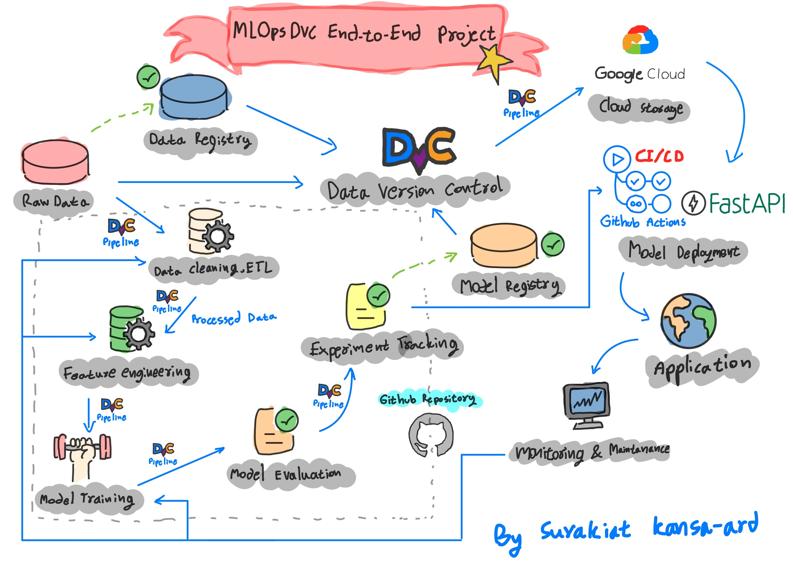

# MLOps DVC End-to-End Project

This project showcases a full Machine Learning Operations (MLOps) pipeline using `DVC (Data Version Control)`, `GitHub Actions` for CI/CD, and `Google Drive` as remote storage. The goal is to demonstrate real-world ML engineering practices from data versioning to automated model deployment.

---
## Project Workflow Architecture



---

## Project Goals

- Build a reproducible and modular ML pipeline using best MLOps practices.
- Version control datasets, models, and experiments with `DVC`.
- Automate training and deployment with `GitHub Actions`.
- Track experiments and register the best model.
- Serve predictions using `FastAPI`.

---

## Project Structure

```
mlops-dvc-end-to-end-project/
│
├── 00_data_versioning/                     # :floppy_disk: Data versioning with DVC
│   ├── README.md                            # :blue_book: Explains versioning strategy
│   └── logs.txt                             # :pencil: Optional DVC outputs/logs
│
├── 01_data_pipelines/                      # :repeat: Reproducible pipelines with DVC
│   ├── dvc.yaml                             # :page_facing_up: DVC pipeline definition
│   ├── dvc.lock                             # :lock: DVC lock file (auto-generated)
│   └── README.md                            # :blue_book: Description of pipeline stages
│
├── 02_experiment_tracking/                 # :test_tube: Track experiments with DVC
│   ├── static/
│   │   └── ...
│   ├── plots/                               # :chart_with_downwards_trend: Metrics and visualizations
│   │   └── ...
│   ├── metrics/                             # :bar_chart: JSON/YAML metrics files
│   │   └── metrics.json
│   ├── README.md                             # :blue_book: How to run and compare experiments
|   ├── report.md
│   └── metrics.json
│
├── 03_model_registry/                      # :books: Manage model versions
│   ├── registry_info.md                     # :blue_book: Model versions, metadata, tags
│   └── README.md                            # :blue_book: Using GTO or DVC Studio
│
├── 04_model_deployment/                   # FastAPI serving & deployment 
│   ├── generate_sample_input.py             # Create sample input JSON 
│   ├── sample_input.json                    # Sample input for /predict endpoint 
│   ├── serve_model.py                       # FastAPI app to serve model 
│   ├── test_api.py                          # Script for testing the API 
│   ├── requirements.txt                     # Dependencies for deployment 
│   └── README.md 
├── data/                                 # Raw and processed data 
│   ├── data.xml                             # Raw XML data 
│   ├── fixed_data.xml                       # Cleaned XML 
│   ├── data.csv                             # Converted CSV 
│   ├── features.csv                         # Final feature matrix 
│   ├── data.xml.dvc                         # DVC-tracked version 
│   └── fixed_data.xml.dvc                   # DVC-tracked version 
├── models/                              # Trained ML models 
│   └── model.pkl                            # Final trained model 
├── src/                                 # Core Python logic (modular) 
│   ├── prepare.py                           # XML → CSV conversion 
│   ├── featurize.py                         # TF-IDF and numeric feature generation 
│   ├── train.py                             # Train model and save 
│   └── evaluate.py                          # Evaluate model performance
│
├── params.yaml                            # :gear: Config file for hyperparameters
├── requirements.txt
├── .dvcignore
├── README.md                              # :blue_book: Project overview and usage
├── .dvc/
├── .github/
└── .gitignore                             # :see_no_evil: Ignore temp files & DVC cache

```

---

## Dataset

- Dataset: StackOverflow posts (from DVC's sample repo)
- Format: XML → Cleaned CSV
- Target variable: `Score` (converted to classification if needed)
- Features: Title + Body + Tags (TF-IDF), ViewCount, AnswerCount, CommentCount

---

## Pipeline Overview

1. **ETL (00_data_versioning/):**
   - Load and clean `data.xml` into `data.csv`
   - Track all data changes using DVC

2. **Data Pipeline (01_data_pipelines/):**
   - `prepare.py`: Convert XML to flat CSV
   - `featurize.py`: TF-IDF + numeric features
   - `train.py`: Train scikit-learn model and save as `model.pkl`

3. **Experiment Tracking (02_experiment_tracking/):**
   - Tune hyperparameters using `dvc exp run`
   - Compare results with `dvc exp show` and `dvc plots`
   - Metrics tracked: Accuracy, F1, Precision, Recall

4. **Model Registry (03_model_registry/):**
   - Restore best experiment via `dvc exp apply`
   - Save metadata in `registry_info.md`
   - Tag model version (e.g., `model-v1`) in Git

5. **Model Deployment (04_model_deployment/):**
   - Serve model using FastAPI
   - Input validation with Pydantic
   - Generate sample input
   - Test API endpoint via Swagger or `test_api.py`

6. **CI/CD via GitHub Actions:**
   - Automatically pulls `model.pkl` from Google Drive (via DVC)
   - Test model serving endpoint
   - Secrets managed in GitHub repository secrets

---

## ML Model Info

- Model Type: Logistic Regression (baseline)
- Libraries used:
  - `scikit-learn`
  - `pandas`, `joblib`
  - `fastapi`, `uvicorn`
- Pipeline: sklearn-style modular functions

---

## Sample Input for API

```json
{
  "data": [[0.1, 0.05, 0.8, ..., 0.03]]  # total 304 features from TF-IDF + numeric
}

```
---
## Visualizations

| Metric    | Plot                 |
| --------- | -------------------- |
| Accuracy  | `eval_accuracy.png`   |
| F1 Score  | `eval_f1.png`          |
| Precision | `eval_precision.png`   |
| Recall    | `eval_recall.png`      |
| Confusion | `confusion_matrix.png` |

- All stored in `02_experiment_tracking/plots/`
---

## Requirements
Install requirements:
```bash
pip install -r 04_model_deployment/requirements.txt
```
---
##  Reproducibility
```bash
# Rebuild entire pipeline
dvc repro

# Compare experiments
dvc exp show

# View metrics
dvc plots show
```
---
## Google Drive Remote (DVC)
- Remote name: myremote
- Configured in GitHub Actions with:
    - `GDRIVE_REMOTE_NAME`
    - `GDRIVE_SERVICE_ACCOUNT_JSON`
    - `GDRIVE_PROJECT_DIR`

---
## Deployment via GitHub Actions
- Trigger: git push to master
- Workflow: `.github/workflows/deploy.yml`
- Auto-pull model from `GDrive`
- Test API with sample input

---
## Key Learnings & Takeaways
- Building a modular, testable ML pipeline improves maintainability.
- `DVC` + `GitHub Actions` is a powerful combo for versioning and automation.
- Structuring projects with MLOps principles sets the foundation for production ML systems.

---
## Next Steps
- Integrate monitoring (e.g., `Prometheus` + `Grafana`)
- Extend to batch predictions or real-time streaming
- Upgrade to model registry tools like `MLflow` or `Weights & Biases`
- Dockerize the `FastAPI` app and deploy to cloud (e.g., `Render`, `GCP`, `AWS`)

---

## Project Author

| Name           | Contact Information                                                  |
|----------------|----------------------------------------------------------------------|
| **Surakiat P.** |                                                                      |
| 📧 Email       | [surakiat.0723@gmail.com](mailto:surakiat.0723@gmail.com)   |
| 🔗 LinkedIn    | [linkedin.com/in/surakiat](https://www.linkedin.com/in/surakiat-kansa-ard-171942351/)     |
| 🌐 GitHub      | [github.com/SurakiatP](https://github.com/SurakiatP)                 |
